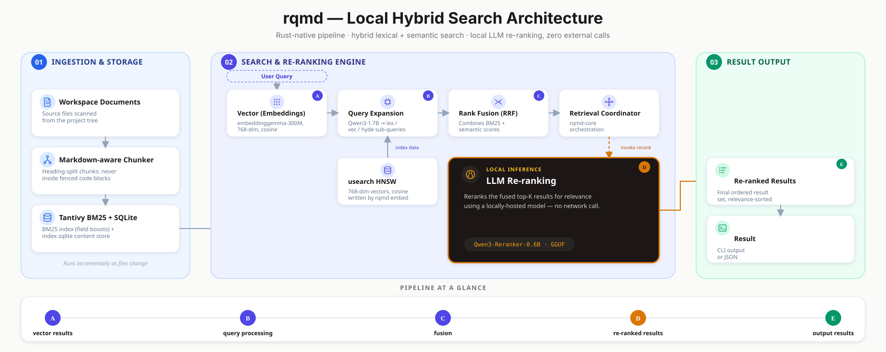

# rqmd

Rust-based mini CLI search engine for your docs, knowledge bases, meeting notes, whatever. Tracking current SOTA approaches while being all local.

Hybrid local document search in a single static binary. No Node. No Bun. No native-module rebuild per platform. Build once, run anywhere.

Built on the search pipeline and ideas of **[tobi/qmd](https://github.com/tobi/qmd)**. Coming from qmd? See [Migrating from qmd](docs/MIGRATING.md).



## Documentation

This README covers the essentials. Everything else lives in `docs/`:

| Doc | Covers |
|-----|--------|
| [docs/INSTALL.md](docs/INSTALL.md) | Full install matrix — Homebrew, cargo, prebuilt binaries, source, ONNX Runtime, Linux/MUSL |
| [docs/CLI.md](docs/CLI.md) | Full command reference, global flags, query syntax and expansion flags, `--format` options, candidate-pool sizing |
| [docs/SYNTAX.md](docs/SYNTAX.md) | Full query grammar — typed lines, lex phrase/negation operators, MCP `searches` array |
| [docs/MODELS.md](docs/MODELS.md) | Inference backends (LlamaCpp / ORT), models table, model configuration and prompt templates |
| [docs/MCP.md](docs/MCP.md) | MCP server tools, daemon lifecycle, binding beyond localhost, tool parameters |
| [docs/CONFIGURATION.md](docs/CONFIGURATION.md) | Excluding files, environment variables, where data lives |
| [docs/ARCHITECTURE.md](docs/ARCHITECTURE.md) | How it works, design decisions, score interpretation, workspace layout |
| [docs/CRATE-API.md](docs/CRATE-API.md) | Rust API for `rqmd-core`, `rqmd-llm`, `rqmd-mcp` |
| [docs/MIGRATING.md](docs/MIGRATING.md) | Differences from qmd + migration guide |
| [docs/TROUBLESHOOTING.md](docs/TROUBLESHOOTING.md) | cmake version issues, slow/failing model downloads, ORT reranking fallback |

Also: [CONTRIBUTING.md](CONTRIBUTING.md) · [SECURITY.md](SECURITY.md) · [DISCLAIMER.md](DISCLAIMER.md)

---

## Why Rust

rqmd ships as a ~60MB self-contained binary with no runtime dependencies:

- SQLite bundled via `rusqlite` — no system SQLite dependency
- BM25 via Tantivy (pure Rust) — no FTS5 extension
- Vector search via usearch (HNSW, C++ header-only, statically linked)
- Inference via llama-cpp-2 (Metal on macOS, CPU on Linux/Windows)

---

## Features

| Feature | Status |
|---------|--------|
| BM25 keyword search | ✅ |
| Vector similarity search (HNSW) | ✅ |
| Hybrid BM25 + vector + RRF | ✅ |
| Cross-encoder reranking | ✅ |
| MCP server (stdio + HTTP) | ✅ |
| Query expansion (lex/vec/hyde via LLM) | ✅ |
| Similar-document search (`rqmd similar`) | ✅ |
| MCP daemon lifecycle management (`mcp status`/`mcp stop`) | ✅ |

Plain-text queries are auto-expanded by a local Qwen3-1.7B model into
`lex`/`vec`/`hyde` sub-queries fused with the original via RRF. Details:
[docs/CLI.md](docs/CLI.md) and [docs/SYNTAX.md](docs/SYNTAX.md).

---

## Installation

```sh
# Homebrew (macOS / Linux — prebuilt, no compile)
brew tap tylern91/rqmd
brew trust tylern91/rqmd  # required on Homebrew ≥4.5
brew install rqmd

# cargo (source build, cross-platform — requires Rust ≥1.78, cmake ≥3.14)
cargo install --git https://github.com/tylern91/rqmd --locked rqmd-cli
```

Prebuilt binary downloads, building from source, the ONNX Runtime backend,
and Linux/MUSL static builds: [docs/INSTALL.md](docs/INSTALL.md).

---

## Quick start

```sh
# Index a directory
rqmd collection add ~/notes --name notes
rqmd context add rqmd://notes/ "Personal notes and ideas"
rqmd embed                          # downloads GGUF models on first run (~900MB)

# Search
rqmd search "project timeline"      # BM25 keyword
rqmd vsearch "deployment process"   # vector similarity
rqmd query "quarterly planning"     # hybrid BM25 + vector + rerank + LLM expansion (best quality)
rqmd similar notes/project-plan.md  # find documents most similar to an already-indexed one

# MCP server (for Claude, Cursor, etc.)
rqmd mcp                            # stdio transport
rqmd mcp --http --port 8181         # Streamable HTTP transport
```

---

## CLI reference

| Command | Description |
|---------|-------------|
| `rqmd query <text>` | Hybrid search: BM25 + vector + rerank + LLM query expansion |
| `rqmd search <text>` | BM25 keyword search only |
| `rqmd vsearch <text>` | Vector similarity only |
| `rqmd embed` / `rqmd update` | Generate embeddings / re-index changed files |
| `rqmd mcp` | Start the MCP server |
| `rqmd collection add <path>` | Add a directory as a collection |
| `rqmd doctor` | Diagnose config, index, model, and device issues |

Full command table, global flags, and query flags (`--intent`, `--format`,
candidate-pool sizing): [docs/CLI.md](docs/CLI.md).

---

## Query syntax and expansion

`rqmd query` auto-expands plain-text queries into `lex`/`vec`/`hyde`
sub-queries via a local LLM, fused with RRF. `rqmd search`/`rqmd vsearch`
run a single mode directly, with no expansion. Typed multi-line queries,
the `--intent` flag, and the full grammar (phrase/negation operators, MCP
`searches` array) are documented in [docs/SYNTAX.md](docs/SYNTAX.md) and
[docs/CLI.md](docs/CLI.md).

---

## Contributing

See [CONTRIBUTING.md](CONTRIBUTING.md) for the full guide — GPG-signing
requirement, commit/branch conventions, the CHANGELOG + semver-label
convention, and what not to rely on yet.

The non-obvious part is the search-quality gate, `rqmd eval` — run it before
any change that touches the search path:

```sh
# BM25 quality (no model, fast — run this always)
cargo run -p rqmd-cli -- eval --mode bm25 --verbose

# Full hybrid quality (requires models — run before search-path changes)
RRQMD_INFERENCE_BACKEND=llama cargo run -p rqmd-cli -- eval --mode hybrid

# Embed throughput (compare backends)
cargo run -p rqmd-cli -- bench -n 5
```

The BM25 eval also runs in CI on every push.

See also: [SECURITY.md](SECURITY.md) for vulnerability reporting and the
known MCP-listener authentication boundary, and
[DISCLAIMER.md](DISCLAIMER.md) for license, warranty, and no-telemetry terms.

---

## Acknowledgements

rqmd is a Rust port of **[tobi/qmd](https://github.com/tobi/qmd)** — the original
TypeScript hybrid-search CLI by [@tobi](https://github.com/tobi). The search
pipeline design, RRF fusion formula, BM25 field weights, chunking parameters, docid
scheme, and MCP tool surface are all derived from that project. See
[BENCHMARK.md](BENCHMARK.md) for the de-risking spike results that validated the
Rust technology choices.

**Coming from qmd?** The quickest path:

```sh
# macOS / Linux — prebuilt binary, no compiler needed
brew tap tylern91/rqmd && brew trust tylern91/rqmd && brew install rqmd

# or build from source
git clone https://github.com/tylern91/rqmd && cd rqmd
./scripts/install.sh          # builds + installs rqmd to ~/.cargo/bin/

rqmd collection add ~/notes   # same pattern as qmd
rqmd embed                    # downloads models on first run (~900 MB)
```

Your existing collections need to be re-added (rqmd uses its own index at
`~/.cache/rqmd/` on Linux, `~/Library/Caches/rqmd/` on macOS), but the search commands and MCP surface work the same way.
See [Migrating from qmd](docs/MIGRATING.md) for the full env-var mapping.
