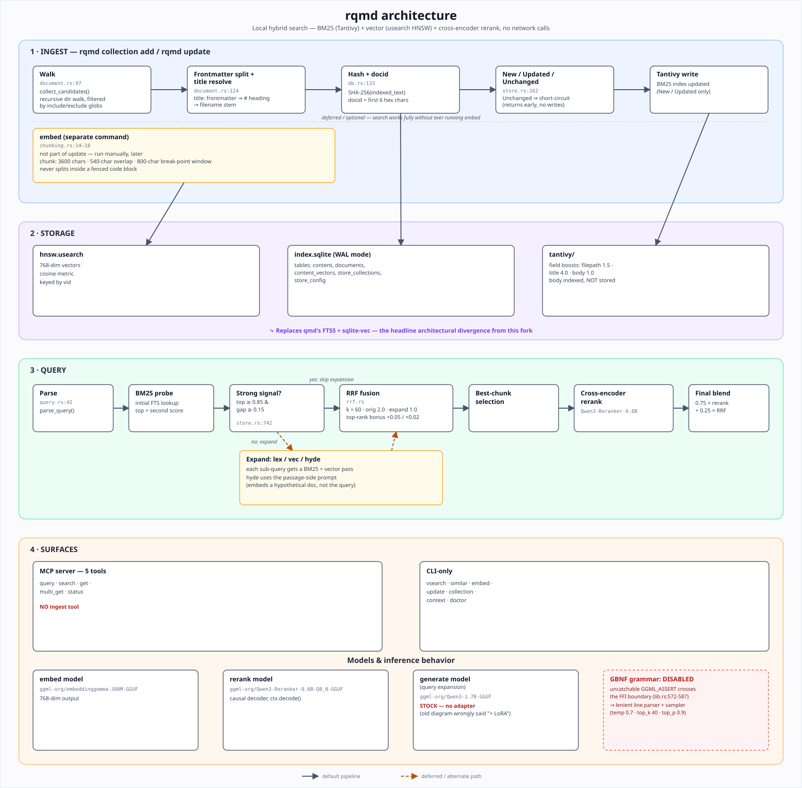

# rqmd

Rust-based mini CLI search engine for your docs, knowledge bases, meeting notes, whatever. Tracking current SOTA approaches while being all local.

Hybrid local document search in a single static binary. No Node. No Bun. No native-module rebuild per platform. Build once, run anywhere.

Built on the search pipeline and ideas of **[tobi/qmd](https://github.com/tobi/qmd)**. Coming from qmd? See [Migrating from qmd](#migrating-from-qmd).

## Contents

- [Why Rust](#why-rust)
- [Features](#features)
- [Installation](#installation)
- [Quick start](#quick-start)
- [CLI reference](#cli-reference)
- [Query syntax and expansion](#query-syntax-and-expansion)
- [Excluding files](#excluding-files)
- [Inference backends](#inference-backends)
- [Models](#models)
- [MCP server](#mcp-server)
- [Environment variables](#environment-variables)
- [Where data lives](#where-data-lives)
- [Workspace layout](#workspace-layout)
- [Crate API](#crate-api)
- [Design decisions](#design-decisions)
- [Score interpretation](#score-interpretation)
- [How it works](#how-it-works)
- [Model configuration](#model-configuration)
- [Differences from qmd](#differences-from-qmd)
- [Migrating from qmd](#migrating-from-qmd)
- [Troubleshooting](#troubleshooting)
- [Contributing](#contributing)
- [Acknowledgements](#acknowledgements)
- [CONTRIBUTING.md](CONTRIBUTING.md) · [SECURITY.md](SECURITY.md) · [DISCLAIMER.md](DISCLAIMER.md)

---

## Why Rust

rqmd ships as a ~60MB self-contained binary with no runtime dependencies:

- SQLite bundled via `rusqlite` — no system SQLite dependency
- BM25 via Tantivy (pure Rust) — no FTS5 extension
- Vector search via usearch (HNSW, C++ header-only, statically linked)
- Inference via llama-cpp-2 (Metal on macOS, CPU on Linux/Windows)

---

## Features

| Feature | Status |
|---------|--------|
| BM25 keyword search | ✅ |
| Vector similarity search (HNSW) | ✅ |
| Hybrid BM25 + vector + RRF | ✅ |
| Cross-encoder reranking | ✅ |
| MCP server (stdio + HTTP) | ✅ |
| Query expansion (lex/vec/hyde via LLM) | ✅ |
| Similar-document search (`rqmd similar`) | ✅ |
| MCP daemon lifecycle management (`mcp status`/`mcp stop`) | ✅ |

Plain-text queries are auto-expanded by a local Qwen3-1.7B model
(`ggml-org/Qwen3-1.7B-GGUF`, downloaded on first `rqmd query`) into `lex`/`vec`/`hyde`
sub-queries fused with the original via RRF (original query keeps 2× weight). Expansion
is best-effort and skipped when the top BM25 hit is a strong, unambiguous match.
Typed multi-line queries and the `--intent` flag are also supported — see
[Query syntax and expansion](#query-syntax-and-expansion) and [docs/SYNTAX.md](docs/SYNTAX.md).

---

## Installation

### Homebrew (macOS / Linux — prebuilt, no compile)

```sh
brew tap tylern91/rqmd
brew trust tylern91/rqmd  # required on Homebrew ≥4.5
brew install rqmd
```

> The formula downloads a prebuilt binary — no Rust toolchain, cmake, or C++ compiler required.
> macOS arm64 and Linux x86_64 are supported. Other platforms: use the source build below.

### cargo install (source build, cross-platform)

Requires Rust stable ≥1.78, cmake ≥3.14, and a C/C++ toolchain (builds llama.cpp from source).

```sh
cargo install --git https://github.com/tylern91/rqmd --locked rqmd-cli
```

On Linux, Metal is not available — prefix with `LLAMA_METAL=0`:

```sh
LLAMA_METAL=0 cargo install --git https://github.com/tylern91/rqmd --locked rqmd-cli
```

### Prebuilt binary (manual download)

Download from the [latest GitHub Release](https://github.com/tylern91/rqmd/releases/latest),
then verify and install. Asset names carry the version (e.g.
`rqmd-v0.8.0-aarch64-apple-darwin.tar.gz`), so resolve the tag first rather than guessing
an unversioned filename:

```sh
VERSION="$(curl -fsSL https://api.github.com/repos/tylern91/rqmd/releases/latest | grep -m1 '"tag_name"' | cut -d'"' -f4)"

# macOS arm64
curl -fLO "https://github.com/tylern91/rqmd/releases/download/${VERSION}/rqmd-${VERSION}-aarch64-apple-darwin.tar.gz"
curl -fLO "https://github.com/tylern91/rqmd/releases/download/${VERSION}/rqmd-${VERSION}-aarch64-apple-darwin.tar.gz.sha256"
shasum -a 256 -c "rqmd-${VERSION}-aarch64-apple-darwin.tar.gz.sha256"
tar -xf "rqmd-${VERSION}-aarch64-apple-darwin.tar.gz"
install -m 0755 rqmd ~/.local/bin/rqmd   # or /usr/local/bin/rqmd

# Linux x86_64
curl -fLO "https://github.com/tylern91/rqmd/releases/download/${VERSION}/rqmd-${VERSION}-x86_64-unknown-linux-gnu.tar.gz"
curl -fLO "https://github.com/tylern91/rqmd/releases/download/${VERSION}/rqmd-${VERSION}-x86_64-unknown-linux-gnu.tar.gz.sha256"
shasum -a 256 -c "rqmd-${VERSION}-x86_64-unknown-linux-gnu.tar.gz.sha256"
tar -xf "rqmd-${VERSION}-x86_64-unknown-linux-gnu.tar.gz"
install -m 0755 rqmd ~/.local/bin/rqmd
```

### From source (recommended while in development)

Requirements: Rust stable (≥1.78), cmake ≥3.14 (cmake 4.x supported), Xcode Command Line Tools (macOS) or `build-essential` (Linux).

```sh
# Clone the repo
git clone https://github.com/tylern91/rqmd
cd rqmd

# Development build (fast, debug symbols)
cargo build -p rqmd-cli

# Optimized release binary (~60MB, fat LTO + stripped)
cargo build --profile dist -p rqmd-cli
# → target/dist/rqmd

# Install to ~/.cargo/bin/ (content-aware: rebuilds only when source changed)
./scripts/install.sh
```

> **Why not `cargo install --path`?** `cargo install` skips reinstalling when the crate version
> is unchanged, so source changes without a version bump are silently ignored. `scripts/install.sh`
> uses `cargo build`'s fingerprinting instead — it rebuilds only when something actually changed,
> then copies the fresh binary into `~/.cargo/bin/`. No `--force`, no manual version bump.

### With ONNX Runtime backend (CoreML / CUDA / DirectML)

```sh
cargo build --profile dist -p rqmd-cli --features ort-backend
# or install directly:
./scripts/install.sh --features ort-backend
```

This downloads the ONNX Runtime library at build time. The resulting binary
supports CoreML (Apple Neural Engine on macOS), CUDA (NVIDIA GPU), and DirectML
(Windows GPU) in addition to the CPU fallback.

### Linux

```sh
sudo apt-get install cmake build-essential
cargo build -p rqmd-cli
```

For a fully static MUSL binary (no glibc dependency):

```sh
rustup target add x86_64-unknown-linux-musl
RUSTFLAGS="-C target-feature=+crt-static" \
  cargo build --profile dist -p rqmd-cli --target x86_64-unknown-linux-musl
```

---

## Quick start

```sh
# Index a directory
rqmd collection add ~/notes --name notes
rqmd context add rqmd://notes/ "Personal notes and ideas"
rqmd embed                          # downloads GGUF models on first run (~900MB)

# Search
rqmd search "project timeline"      # BM25 keyword
rqmd vsearch "deployment process"   # vector similarity
rqmd query "quarterly planning"     # hybrid BM25 + vector + rerank + LLM expansion (best quality)
rqmd similar notes/project-plan.md  # find documents most similar to an already-indexed one

# MCP server (for Claude, Cursor, etc.)
rqmd mcp                            # stdio transport
rqmd mcp --http --port 8181         # Streamable HTTP transport
```

---

## CLI reference

| Command | Description |
|---------|-------------|
| `rqmd query <text> [--no-expand]` | Hybrid search: BM25 + vector + rerank + LLM query expansion |
| `rqmd search <text>` | BM25 keyword search only |
| `rqmd vsearch <text>` | Vector similarity only |
| `rqmd similar <path\|#docid>` | Find documents most similar to an already-indexed one |
| `rqmd get <path\|#docid>` | Retrieve document by path or content hash |
| `rqmd multi-get <glob>` | Retrieve multiple documents |
| `rqmd ls [collection[/path]]` | List collections or files |
| `rqmd embed [-c collection] [--rebuild]` | Generate embeddings (`--rebuild`: clear vectors and re-embed from scratch) |
| `rqmd update [-c collection]` | Re-index: reports new, updated, unchanged, and removed (soft-deleted) document counts |
| `rqmd status` | Index health and collection summary |
| `rqmd doctor` | Diagnose config, index, model, and device issues |
| `rqmd bench [-n N]` | Embed throughput benchmark (default: 5 rounds) |
| `rqmd eval [--mode bm25\|vec\|hybrid] [--verbose]` | Search quality eval against synthetic fixtures |
| `rqmd mcp [--http] [--port N] [--host HOST] [--daemon]` | Start MCP server |
| `rqmd mcp status` | Show MCP daemon status (pid, health, uptime) |
| `rqmd mcp stop` | Stop the running MCP daemon |
| `rqmd collection add <path> [--mask PATTERN] [--ignore PATTERN] [--hidden]` | Add a directory as a collection |
| `rqmd collection list` | List all collections |
| `rqmd collection remove <name>` | Remove a collection |
| `rqmd collection rename <old> <new>` | Rename a collection |
| `rqmd collection show <name>` | Show collection details |
| `rqmd collection update-cmd <name> [cmd]` | Set/clear pre-update hook |
| `rqmd collection include/exclude <name>` | Toggle from default queries |
| `rqmd context add [path] <text>` | Add context for a path |
| `rqmd context list` | List all contexts |
| `rqmd context rm <path>` | Remove context |
| `rqmd context check` | Find paths missing context |
| `rqmd init` | Create a project-local `.rqmd` index |

Global flags (before the subcommand):

```
--index-dir <path>       Override index directory ($RRQMD_INDEX_DIR)
--backend llama|ort      Inference backend ($RRQMD_INFERENCE_BACKEND)
--ort-ep auto|coreml|cuda|directml|cpu   ORT execution provider ($RRQMD_ORT_EP)
```

---

## Query syntax and expansion

`rqmd query` (and the MCP `query` tool) auto-expand plain-text queries using a local
Qwen3-1.7B model, producing `lex`, `vec`, and `hyde` variants that are fused with the
original query via RRF. `rqmd search` and `rqmd vsearch` do **not** expand — they run
their respective single-mode search only.

**`rqmd query` flags:**

| Flag | Default | Description |
|------|---------|-------------|
| `--intent <text>` | *(none)* | Background context to steer expansion and reranking |
| `-n <num>` | `10` | Number of results to return |
| `-c/--collection <name>` | *(all)* | Scope to a collection (repeatable, OR-matched) |
| `--no-expand` | off | Skip LLM query expansion; search the query text as-is (env: `RRQMD_NO_EXPAND`) |
| `--no-rerank` | off | Skip cross-encoder reranking (expansion still runs) |
| `--full` | off | Return full document bodies instead of snippets |
| `--format <fmt>` | `cli` | Output format — see below |

**`--format` values:**

| Value | Description |
|-------|-------------|
| `cli` | Human-readable, colorized terminal output |
| `json` | Pretty-printed JSON array of results |
| `csv` | `docid,score,file,title,context,line,snippet` — every field is CSV-escaped (quoted, with embedded quotes doubled, whenever it contains a comma, quote, or newline) |
| `md` (alias `markdown`) | Markdown-formatted result list |
| `xml` | XML-wrapped result list |
| `files` | Just the absolute filesystem path of each matching file, one per line — pipeable straight into `xargs` |

An unrecognized `--format` value is a hard argument-parsing error (clap rejects
it before the command runs) — it no longer silently falls back to `cli`.
`rqmd get` and `rqmd multi-get` only support `cli`, `json`, and `files`; passing
`csv`, `md`, or `xml` to those two commands fails with an explicit error rather
than producing malformed output.

**Candidate pool sizing (`-n`):** reranking is the expensive step — each
candidate costs one `LlamaContext` evaluation — so the number of chunks
fetched for reranking is not simply the requested `-n`. rqmd asks for
`limit * 2` candidates, then clamps that to a minimum of 20 and a maximum of
100. Requesting more than 50 results (which would ask for over 100
candidates) triggers a logged warning that the candidate pool has been capped
at 100, rather than silently truncating — since rerank cost scales linearly
with pool depth, this cap keeps `-n` from causing runaway latency.

**Examples:**

```sh
# Plain text — auto-expanded into lex/vec/hyde by the LLM
rqmd query "how does authentication work"

# Explicit expand (equivalent to above)
rqmd query "expand: how does authentication work"

# Typed multi-line query (bypasses LLM; each line is a direct sub-query)
rqmd query $'lex: auth token -oauth\nvec: how does authentication work\nhyde: The auth system uses JWT tokens with a 15-minute TTL...'

# Intent flag — steers expansion and reranking toward web performance
rqmd query --intent "web page load times" "performance"

# Intent inline (query document)
rqmd query $'intent: web page load times\nlex: performance\nvec: how to improve page speed'

# Scope to a specific collection
rqmd query -c docs "deployment pipeline"
```

Full grammar (typed lines, lex phrase/negation operators, MCP `searches` array):
[docs/SYNTAX.md](docs/SYNTAX.md).

---

## Excluding files

By default rqmd indexes every file matching a collection's mask pattern
(`**/*.md`). It reads **no** ignore files — `.gitignore` and `.ignore` are
never consulted.

**Built-in exclusions** (skipped unless overridden):

- Hidden files and directories — any path component (relative to the
  collection root) starting with `.`. Pass `--hidden` when adding a
  collection to index these. This only affects components *inside* the
  tree: the collection root itself is never subject to this rule, so adding
  a dot-prefixed directory (e.g. `~/.dotfiles`) as a collection always works
  regardless of `--hidden`.
- `node_modules`, `vendor`, `dist`, `build`, `target`, `.cache` — these are
  always skipped and are not affected by `--hidden`.

```sh
# Index hidden files/dirs under the collection root too
rqmd collection add ~/notes --hidden
```

**`--mask` — which files are candidates for indexing:**

The mask is a glob (default `**/*.md`) evaluated relative to the collection
root. Two ways to match more than one pattern:

```sh
# Brace alternation — a single glob, one pattern
rqmd collection add ~/notes --mask '**/*.{md,mdx,txt}'

# Comma-separated globs — split on top-level commas only (commas inside
# {...} are left alone, so the two forms can be combined)
rqmd collection add ~/notes --mask '**/*.md,**/*.txt'

# Directory-scoped glob — restrict to a subtree
rqmd collection add ~/docs --mask 'docs/**/*.md'
```

An invalid `--mask` glob is a hard error at `collection add` time (it decides
what gets indexed at all, so a silently-dropped alternative would mean
documents vanish from the index with no diagnostic). An invalid `--ignore`
glob, by contrast, is silently skipped — an unmatchable extra exclusion is
harmless.

**Per-collection ignore patterns** (gitignore-style globs):

```sh
# Exclude patterns when adding a collection
rqmd collection add ~/notes --ignore '*.log' --ignore 'tmp/'

# Multiple patterns are combined with OR — any match excludes the file
rqmd collection add ~/docs --ignore 'drafts/**' --ignore '**/node_modules'
```

Mask and ignore patterns are stored with the collection and apply on every
subsequent `rqmd update` run — you only need to specify them once.

---

## Inference backends

Two backends are available, selected at runtime via env var or `--backend` flag.

### LlamaCppBackend (default)

Uses [llama-cpp-2](https://github.com/utilityai/llama-cpp-rs) to run GGUF models locally.

| Role | Model | Size |
|------|-------|------|
| Embeddings | `ggml-org/embeddinggemma-300M-GGUF` | ~300MB |
| Reranking | `ggml-org/Qwen3-Reranker-0.6B-Q8_0-GGUF` | ~600MB |

Models are downloaded automatically from HuggingFace on first use and cached
at `~/.cache/huggingface/hub/`.

On macOS, llama.cpp uses Metal (Apple GPU) automatically. On Linux, CPU-only
unless CUDA is available.

```sh
rqmd embed                          # uses LlamaCppBackend by default
rqmd --backend llama embed          # explicit
RRQMD_INFERENCE_BACKEND=llama rqmd embed
```

### OrtBackend (`ort-backend` feature)

Uses [ONNX Runtime](https://ort.pyke.io/) with pluggable execution providers.
Build with `--features ort-backend`.

| Role | Model | Size |
|------|-------|------|
| Embeddings | `BAAI/bge-base-en-v1.5` (ONNX) | ~440MB |
| Reranking | *(not supported — falls back to LlamaCppBackend)* | — |

Execution providers selected by `--ort-ep` or `RRQMD_ORT_EP`:

| EP | Flag | Platform | Hardware |
|----|------|----------|----------|
| CoreML | `coreml` | macOS | Apple Neural Engine + GPU |
| CUDA | `cuda` | Linux / Windows | NVIDIA GPU |
| DirectML | `directml` | Windows | Any GPU via DirectML |
| CPU | `cpu` | All | CPU fallback |
| Auto | `auto` (default) | All | CoreML on macOS, CPU elsewhere |

```sh
# CoreML (Apple Neural Engine — fastest for embed-sized models on M-series)
RRQMD_INFERENCE_BACKEND=ort RRQMD_ORT_EP=coreml rqmd embed
rqmd --backend ort --ort-ep coreml embed
```

---

## Models

| Role | Backend | Model | Size |
|------|---------|-------|------|
| Embeddings | LlamaCpp (default) | `ggml-org/embeddinggemma-300M-GGUF` | ~300 MB |
| Reranking | LlamaCpp | `ggml-org/Qwen3-Reranker-0.6B-Q8_0-GGUF` | ~600 MB |
| Embeddings | ORT (`ort-backend` feature) | `BAAI/bge-base-en-v1.5` (ONNX) | ~440 MB |
| Query expansion | LlamaCpp | `ggml-org/Qwen3-1.7B-GGUF` (`Qwen3-1.7B-Q8_0.gguf`) | ~1.7 GB |

Models download automatically from HuggingFace on first use (~900 MB for embed + rerank; ~2.6 GB with query expansion) and are cached at `~/.cache/huggingface/hub/`. All three model repos are public — no token is required for a normal download.

Set `HF_ENDPOINT` to use a mirror, or `HF_HUB_OFFLINE=1` to disable downloads entirely and require every model to already be cached — rqmd fails with an actionable error naming the missing file instead of attempting a request. If `~/.cache/huggingface/token` holds an expired or invalid token, rqmd retries anonymously rather than failing outright; set `HF_TOKEN` or `HUGGING_FACE_HUB_TOKEN` to use a specific token instead (checked in that order, ahead of the cached token file).

---

## MCP server

rqmd includes a built-in MCP server exposing its search index as tools for Claude, Cursor, and other MCP-aware clients.

| Tool | Description |
|------|-------------|
| `query` | Hybrid search: BM25 + vector + rerank + LLM expansion (recommended) |
| `search` | BM25 keyword search — no models required |
| `get` | Retrieve a document by path or content hash |
| `multi_get` | Retrieve multiple documents by glob pattern |
| `status` | Index health and collection summary |

```sh
rqmd mcp                        # stdio (Claude Desktop, Cursor, etc.)
rqmd mcp --http                 # Streamable HTTP on port 8181
rqmd mcp --http --port 9000     # custom port
rqmd mcp --http --host 0.0.0.0  # bind on all interfaces — see warning below
rqmd mcp --daemon               # background HTTP (implies --http)
rqmd mcp status                 # pid, health, uptime of the running daemon
rqmd mcp stop                   # stop the running daemon
```

For Claude Desktop, add to `claude_desktop_config.json`:

```json
{
  "mcpServers": {
    "rqmd": {
      "command": "rqmd",
      "args": ["mcp"]
    }
  }
}
```

### Daemon lifecycle

`rqmd mcp --daemon` forks the HTTP server into the background and tracks it
under the index directory: a pidfile at `<index-dir>/mcp.pid` and its
stdout/stderr log at `<index-dir>/mcp.log`. `rqmd mcp status` and
`rqmd mcp stop` don't just trust the pidfile — before sending a stop signal
or reporting the daemon as running, they issue a `GET /health` request on the
recorded host:port and cross-check the pid the daemon reports against the
pid on record. Only an exact match counts as confirmed; an unreachable
`/health` means the pidfile is stale, and a reachable `/health` reporting a
*different* pid means another process now owns that port. Starting a daemon
on a port that's already bound fails immediately with an error instead of
silently colliding with the existing listener.

### Binding beyond localhost

`--host` (default `127.0.0.1`, env `RRQMD_MCP_HOST`) controls the bind
address for `--http`/`--daemon` mode; `--port` (default `8181`, env
`RRQMD_MCP_PORT`) controls the port. Binding to anything other than a
loopback address prints this warning to stderr:

> WARNING: binding to {host} exposes this index's full-text and semantic
> search — including `get`, which returns arbitrary indexed file content —
> with no authentication to anything that can reach {host}:{port}. Only do
> this on a trusted network or container.

rqmd ships **no authentication** for the HTTP/MCP listener at all — anyone
who can reach the bound host:port can query and read every indexed
document. Treat `--host 0.0.0.0` (or any non-loopback address) as
production-network-exposure, not a convenience flag.

### MCP tool parameters

Exact input fields per tool, as accepted by the JSON-RPC tool call
(`collections` is plural, matching the CLI's repeatable `-c`/`--collection`):

| Tool | Field | Type | Notes |
|------|-------|------|-------|
| `query` | `query` | `string` (required) | The search text |
| | `intent` | `string`, optional | Background context steering expansion/reranking |
| | `collections` | `string[]`, optional | Scope to these collections |
| | `limit` | `number`, optional | Default 10 |
| | `rerank` | `boolean`, optional | Default `true` |
| | `expand` | `boolean`, optional | Default `true` |
| `search` | `query` | `string` (required) | BM25-only search text |
| | `collections` | `string[]`, optional | Scope to these collections |
| | `limit` | `number`, optional | Default 10 |
| `get` | `file` | `string` (required) | Path or `#docid` |
| | `from_line` | `number`, optional | Start line for partial retrieval |
| | `max_lines` | `number`, optional | Cap on lines returned |
| `multi_get` | `pattern` | `string` (required) | Glob pattern |
| | `collections` | `string[]`, optional | Scope to these collections |
| | `max_lines` | `number`, optional | Cap on lines returned per document |
| `status` | *(none)* | | Takes no input |

---

## Environment variables

| Variable | Values | Default | Description |
|----------|--------|---------|-------------|
| `RRQMD_INDEX_DIR` | path | `~/.cache/rqmd/` (Linux) / `~/Library/Caches/rqmd/` (macOS) | Index storage directory |
| `RRQMD_INFERENCE_BACKEND` | `llama`, `ort` | `llama` | Inference backend |
| `RRQMD_ORT_EP` | `auto`, `coreml`, `cuda`, `directml`, `cpu` | `auto` | ONNX Runtime EP |
| `RRQMD_FORCE_CPU` | `1` | *(unset)* | Disable GPU layers in LlamaCppBackend |
| `RRQMD_MCP_HOST` | host/IP | `127.0.0.1` | Bind address for `rqmd mcp --http`/`--daemon` |
| `RRQMD_MCP_PORT` | port number | `8181` | Bind port for `rqmd mcp --http`/`--daemon` |
| `RRQMD_MODEL_IDLE_TTL` | seconds | `300` | MCP daemon: unload an idle model after this many seconds of no use; `0` disables eviction |
| `RRQMD_NO_EXPAND` | `1` | *(unset)* | Equivalent to always passing `--no-expand` to `rqmd query` |
| `RRQMD_VERBOSE` | `1` | *(unset)* | Verbose ORT backend logging |

---

## Where data lives

Paths below use the Linux default; on macOS the base is `~/Library/Caches/` instead of `~/.cache/` (from `dirs::cache_dir()`).

| What | Path |
|------|------|
| Index + collections (SQLite) | `~/.cache/rqmd/index.sqlite` |
| BM25 index (Tantivy) | `~/.cache/rqmd/tantivy/` |
| Vector index (usearch) | `~/.cache/rqmd/hnsw.usearch` |
| Model cache (HuggingFace) | `~/.cache/huggingface/hub/` |
| Project-local index | `.rqmd/` (created by `rqmd init`) |

Override the root index directory with `--index-dir <path>` or `$RRQMD_INDEX_DIR`.

---

## Workspace layout

```
rqmd/                    # repo root = Cargo workspace
├── Cargo.toml           # workspace definition + release/dist profiles
├── .cargo/config.toml   # MUSL static build target config
├── crates/
│   ├── rqmd-core/       # engine: search, chunking, store, collections
│   ├── rqmd-llm/        # inference backends (LlamaCpp + ORT)
│   ├── rqmd-cli/        # CLI entry point (clap)
│   └── rqmd-mcp/        # MCP server (rmcp, stdio + HTTP)
├── docs/                # SYNTAX.md and other reference docs
└── assets/              # rqmd-architecture.svg
```

### Build profiles

| Profile | Command | LTO | Strip | Use |
|---------|---------|-----|-------|-----|
| `dev` | `cargo build` | off | none | development |
| `release` | `cargo build --release` | thin | debuginfo | testing |
| `dist` | `cargo build --profile dist` | fat | symbols | release binary |

---

## Crate API

### `rqmd-core`

The search engine. Key public types:

```rust
use rqmd_core::{Store, StoreConfig, SearchResult};

let store = Store::open(config, backend)?;

// Index a document
store.index_document("collection", "rel/path.md", "Title", &body)?;

// Hybrid search: BM25 + vector + RRF + rerank
let results: Vec<SearchResult> = store.hybrid_query("search terms", 10, None, false)?;

// BM25 keyword search
let results = store.search_fts("keyword", 10, None)?;

// Vector similarity search
let results = store.search_vec("semantic query", 10, None)?;
```

### `rqmd-llm`

Inference backend abstraction. Implement `InferenceBackend` to add a new backend:

```rust
use rqmd_llm::{InferenceBackend, BackendKind, create_backend};

pub trait InferenceBackend: Send {
    fn embed(&mut self, text: &str) -> Result<Vec<f32>>;
    fn embed_batch(&mut self, texts: &[&str]) -> Result<Vec<Vec<f32>>>;
    fn rerank(&mut self, query: &str, docs: &[&str]) -> Result<Vec<f32>>;
    fn generate(&mut self, prompt: &str) -> Result<String>;
    fn embed_model_name(&self) -> &str;
    fn rerank_model_name(&self) -> &str;
}

// Factory: reads RRQMD_INFERENCE_BACKEND + RRQMD_ORT_EP from env
let backend: Box<dyn InferenceBackend> = create_backend(&BackendKind::from_env())?;
```

All embeddings are returned as **unit-normalized f32 vectors** (L2 norm = 1.0).
Cosine similarity is therefore equivalent to dot product.

### `rqmd-mcp`

MCP server with five tools:

| Tool | Description |
|------|-------------|
| `query` | Hybrid search (recommended) |
| `search` | BM25 keyword search |
| `get` | Retrieve document by path or docid |
| `multi_get` | Retrieve multiple documents by glob |
| `status` | Index health summary |

Start modes:

```sh
rqmd mcp                        # stdio (for Claude Desktop, Cursor, etc.)
rqmd mcp --http                 # Streamable HTTP on port 8181
rqmd mcp --http --port 9000     # custom port
```

---

## Design decisions

| Aspect | Choice |
|--------|--------|
| Search backend | Tantivy (BM25) + usearch (HNSW) |
| Index location | `~/.cache/rqmd/` (Linux) / `~/Library/Caches/rqmd/` (macOS) |
| Embed model | embeddinggemma-300M (GGUF, Metal/CPU) |
| Rerank model | Qwen3-Reranker-0.6B (GGUF) |
| ORT backend | ✓ CoreML / CUDA / DirectML (feature-gated) |
| Query expansion | ✓ LLM-generated lex/vec/hyde (stock Qwen3-1.7B), fused via RRF |
| MlxBackend | Deferred — `mlx-rs` `Array: !Send` conflicts with parallel embed pool |
| Startup time | ~5ms (no JIT) |

The RRF fusion formula, BM25 field weights, chunking parameters (900 tokens /
15% overlap), and docid scheme (`first 6 hex chars of SHA-256(content)`) match
the original qmd design so search quality is preserved.

See [BENCHMARK.md](BENCHMARK.md) for the de-risking spike results (inference backend
+ DB bake-off) that drove the Tantivy+usearch and llama-cpp-2 decisions.

---

## Score interpretation

Every result carries a single `score` field, but what that number *means*
depends on which stage produced it — and the three stages are not on a
common scale, so comparing a 0.62 from one query to a 0.71 from another
tells you very little on its own.

- **BM25 / FTS score** (`rqmd search`): Tantivy's raw BM25 score is a
  positive, unbounded value where higher is better, but its magnitude isn't
  meaningful in isolation — it depends on term rarity and document length.
  rqmd squashes it into a fixed `[0, 1)` range with the monotonic
  transform `score / (1 + score)`. This preserves ordering exactly (it's
  monotonic) and needs no per-query normalization, but it means a 0.9 from
  one query and a 0.9 from another aren't "equally good" in any absolute
  sense — the transform only makes the *number* boundable, not
  cross-query-comparable.
- **Vector / cosine score** (`rqmd vsearch`): embeddings are unit-normalized,
  so nearest-neighbor search reduces to cosine similarity. The underlying
  index returns a distance where 0 means identical; rqmd reports
  `1 - distance` as the similarity, so 1.0 is a perfect match and scores
  trend toward 0 (or negative, in principle) as vectors diverge.
- **Hybrid / fused score** (`rqmd query`): the default pipeline runs BM25
  and vector search (plus LLM-expanded lex/vec/hyde variants when expansion
  is active) as separate ranked lists, then fuses them with Reciprocal Rank
  Fusion. Each list contributes `weight / (60 + rank + 1)` per document,
  where `rank` is that document's zero-based position within its list
  after collapsing duplicate chunks down to one entry per document. The
  original query's own lists get weight 2.0; expansion-derived lists get
  weight 1.0. Whichever list ranks a document at position 0 anywhere adds a
  flat +0.05 bonus; ranking at position 1 or 2 (without hitting position 0)
  adds +0.02. These bonuses apply unconditionally — they aren't gated on
  how far ahead of the next result a document is — so the fused score is a
  relative ranking signal assembled from several inputs, not a probability
  or confidence value. When reranking runs, the cross-encoder's score for a
  candidate is blended back in as `0.75 * rerank_score + 0.25 * rrf_score`;
  rerank scores themselves are not normalized across pairs, so this blend
  is only meaningful as a way of biasing the RRF ordering, not as an
  absolute quality metric either.

The practical takeaway: use scores to compare results *within* one query's
result set, not across different queries or across `search`/`vsearch`/`query`
modes. Because RRF's OR-semantics mean a document can rank purely from
matching one of several expansion variants, plus the unconditional rank
bonuses above, there's no fixed score threshold below which a result is
"irrelevant" — a low fused score can still be the best available match for
a query with generally weak recall.

---

## How it works



**Indexing** (`rqmd collection add` / `rqmd update`): each matched file is
read, hashed (SHA-256 of its content — the resulting hash's first 6 hex
characters become the document's `#docid`), and inserted into the BM25 index
immediately. Vector indexing is a separate, deferred step — `rqmd update`
only touches BM25 and bookkeeping, so it stays usable without a model loaded.

**Embedding** (`rqmd embed`): documents that don't have vectors yet (or, with
`--rebuild`, every document) are split into chunks, each chunk is embedded,
and the resulting vectors are added to the HNSW index. `rqmd doctor` can
detect when the chunking parameters or embed model have changed since the
last embed run by comparing a stored fingerprint (below) against the current
configuration.

**Query**: `rqmd search` and `rqmd vsearch` each run a single retrieval mode
directly. `rqmd query` (and the MCP `query` tool) additionally runs LLM-based
query expansion by default — see [Query syntax and expansion](#query-syntax-and-expansion)
— fuses every resulting list with RRF, and reranks the fused candidates with
a cross-encoder. As a latency optimization, if the initial BM25 probe on the
raw query already returns a dominant top result (score above a fixed
threshold with a clear gap to the runner-up), expansion is skipped entirely
and the pipeline proceeds directly to reranking that candidate set.

### Smart chunking

Documents longer than the chunk size are split at content-aware break
points rather than at a fixed character offset. The chunker looks for the
highest-scoring break point inside a window centered on the ideal cut
position, scoring candidates by what kind of boundary they are: an H1
heading scores highest, descending through H2–H6, with code-fence
boundaries and horizontal rules scored similarly high, blank lines (paragraph
breaks) lower, list items lower still, and a bare newline as the last
resort. Breaks are never placed inside a fenced code block — if the ideal
cut would land inside one, the search continues past it.

The chunk target is 3,600 characters (roughly 900 tokens at the ~4
characters/token EmbeddingGemma tends toward) with a 540-character (15%)
overlap between consecutive chunks, and the break-point search window
extends 400 characters either side of the ideal cut. Because these figures
are byte offsets into UTF-8 text, and multi-byte characters (accented
letters, em dashes, CJK text) can span two or three bytes each, every
computed cut point is snapped forward or backward to the nearest valid
character boundary before the text is sliced — cutting mid-character would
otherwise corrupt the chunk and panic on decode.

These three constants (embed model name, chunk size, chunk overlap) feed a
short fingerprint hash that gets stored alongside the index. If any of them
changes — a different embed model, or a future tuning pass on the chunking
parameters — the stored fingerprint no longer matches, and `rqmd doctor`
surfaces that the existing vectors were built under a different
configuration and may need re-embedding.

---

## Model configuration

rqmd's default backend uses three local GGUF models: an embedding model, a
reranker, and a small generation model for query expansion.

**Asymmetric embedding prompts**: the embedding model documents different
recommended prompt templates for queries versus the passages being searched,
and rqmd honors that distinction rather than embedding both sides
identically. Query-side text (and HyDE's hypothetical-document text, which
plays a query's role in the pipeline) is prefixed with
`"task: search result | query: "`; passage-side text (indexed document
chunks) is prefixed with `"title: none | text: "` — the "no title" form of
the documented template, since threading real per-chunk titles through
wasn't judged worth the added plumbing. Using the wrong prefix on either
side doesn't break the pipeline, but it does mean queries and documents
embed into slightly different regions of the vector space than the model
intends, degrading retrieval quality.

**Reranking**: the cross-encoder scores a query/document pair using the
template `"Query: {query}\nDocument: {doc}"`. As noted in
[Score interpretation](#score-interpretation), these scores are not
normalized across pairs — they're only meaningful as a relative ordering
within one rerank call, which is why they're blended with, rather than
replacing, the RRF score.

**Query expansion**: the generation model is prompted with a ChatML-formatted
instruction asking it to produce short `lex:`/`vec:`/`hyde:` lines — a
literal-keyword variant, a semantic-phrasing variant, and a hypothetical
answer passage, respectively — which are parsed back out of its free-form
output and fed into the fusion pipeline as separate ranked lists.

**Backend parity note**: the local llama.cpp-based backend explicitly
L2-normalizes every embedding vector it returns, even though the embedding
model's own output is expected to already be close to unit length. This
exists so that the local and ONNX Runtime backends produce vectors with
identical normalization guarantees — cosine similarity is scale-invariant,
so a vector that's merely *close to* unit length would still rank
identically within a single backend's own index. The normalization matters
for consistency of the stored contract across backends, not for
within-backend ranking correctness.

---

## Differences from qmd

| Feature | qmd (TypeScript) | rqmd (Rust) |
|---------|-----------------|-------------|
| Runtime | Node.js required | Self-contained static binary |
| Startup | ~300 ms (JIT) | ~5 ms |
| Search pipeline | BM25 + vector + RRF + rerank | Same pipeline, same parameters |
| MCP server identity | `qmd` | `rqmd` |
| Chunking | tree-sitter AST-aware | Regex heuristic (headings, code fences, lists) |
| Index location | `~/.cache/qmd/` | `~/.cache/rqmd/` (Linux) / `~/Library/Caches/rqmd/` (macOS) |
| File exclusion | `.gitignore` aware | Built-in exclusions + per-collection `ignore` list |

Search quality is equivalent — the RRF formula, BM25 field weights, chunk size (900 tokens / 15% overlap), and docid scheme are all ported verbatim from qmd.

---

## Migrating from qmd

rqmd uses its own index at `~/.cache/rqmd/` (Linux) / `~/Library/Caches/rqmd/` (macOS) — existing qmd collections need to be re-added:

```sh
rqmd collection add ~/path/to/your/docs --name your-collection
rqmd embed
```

All environment variables are prefixed `RRQMD_` instead of `QMD_`:

| Old (qmd) | New (rqmd) |
|-----------|----------|
| `QMD_INDEX_DIR` | `RRQMD_INDEX_DIR` |
| `QMD_INFERENCE_BACKEND` | `RRQMD_INFERENCE_BACKEND` |
| `QMD_ORT_EP` | `RRQMD_ORT_EP` |
| `QMD_FORCE_CPU` | `RRQMD_FORCE_CPU` |

The MCP server now identifies as `rqmd` — update any `claude_desktop_config.json` entries accordingly.

---

## Troubleshooting

### cmake version requirements

cmake ≥3.14 is required. cmake 4.x is supported — the `llama-cpp-sys-2` crate
(which builds llama.cpp from source) builds correctly with cmake 4.x on macOS
and Linux. You do not need to pin or downgrade cmake.

**Do not** add `target-cpu` flags to `.cargo/config.toml` — they change the
llama-cpp-sys fingerprint and force a cmake rebuild. Pass them at build time:

```sh
RUSTFLAGS="-C target-cpu=native" cargo build --profile dist -p rqmd-cli
```

### Model downloads are slow / fail

Models are fetched from HuggingFace on first `rqmd embed` and cached at
`~/.cache/huggingface/hub/`. Set `HF_ENDPOINT` for a mirror, or
`HF_HUB_OFFLINE=1` to require every model to already be cached (fails fast
with the expected file path instead of trying the network).

`rqmd doctor` reports which models are cached without downloading anything —
run it first if `rqmd embed` reports a model as missing unexpectedly.

**401 Unauthorized**: these model repos are public, so a 401 almost always
means a stale token, not a permissions problem. rqmd retries anonymously if
the token in `~/.cache/huggingface/token` is rejected; if the retry also
fails, run `huggingface-cli login` to refresh it, or delete that file to
download anonymously. Set `HF_TOKEN` or `HUGGING_FACE_HUB_TOKEN` to use a
specific token instead of the cached one.

### "OrtBackend: reranking not supported"

`OrtBackend` handles embeddings only. Reranking uses `LlamaCppBackend`
automatically as a fallback.

---

## Contributing

See [CONTRIBUTING.md](CONTRIBUTING.md) for the full guide — GPG-signing
requirement, commit/branch conventions, the CHANGELOG + semver-label
convention, and what not to rely on yet.

The non-obvious part is the search-quality gate, `rqmd eval` — run it before
any change that touches the search path:

```sh
# BM25 quality (no model, fast — run this always)
cargo run -p rqmd-cli -- eval --mode bm25 --verbose

# Full hybrid quality (requires models — run before search-path changes)
RRQMD_INFERENCE_BACKEND=llama cargo run -p rqmd-cli -- eval --mode hybrid

# Embed throughput (compare backends)
cargo run -p rqmd-cli -- bench -n 5
```

The BM25 eval also runs in CI on every push.

See also: [SECURITY.md](SECURITY.md) for vulnerability reporting and the
known MCP-listener authentication boundary, and
[DISCLAIMER.md](DISCLAIMER.md) for license, warranty, and no-telemetry terms.

---

## Acknowledgements

rqmd is a Rust port of **[tobi/qmd](https://github.com/tobi/qmd)** — the original
TypeScript hybrid-search CLI by [@tobi](https://github.com/tobi). The search
pipeline design, RRF fusion formula, BM25 field weights, chunking parameters, docid
scheme, and MCP tool surface are all derived from that project. See
[BENCHMARK.md](BENCHMARK.md) for the de-risking spike results that validated the
Rust technology choices.

**Coming from qmd?** The quickest path:

```sh
# macOS / Linux — prebuilt binary, no compiler needed
brew tap tylern91/rqmd && brew trust tylern91/rqmd && brew install rqmd

# or build from source
git clone https://github.com/tylern91/rqmd && cd rqmd
./scripts/install.sh          # builds + installs rqmd to ~/.cargo/bin/

rqmd collection add ~/notes   # same pattern as qmd
rqmd embed                    # downloads models on first run (~900 MB)
```

Your existing collections need to be re-added (rqmd uses its own index at
`~/.cache/rqmd/` on Linux, `~/Library/Caches/rqmd/` on macOS), but the search commands and MCP surface work the same way.
See [Migrating from qmd](#migrating-from-qmd) for the full env-var mapping.
